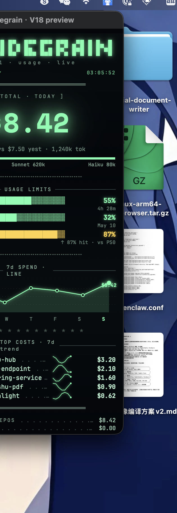
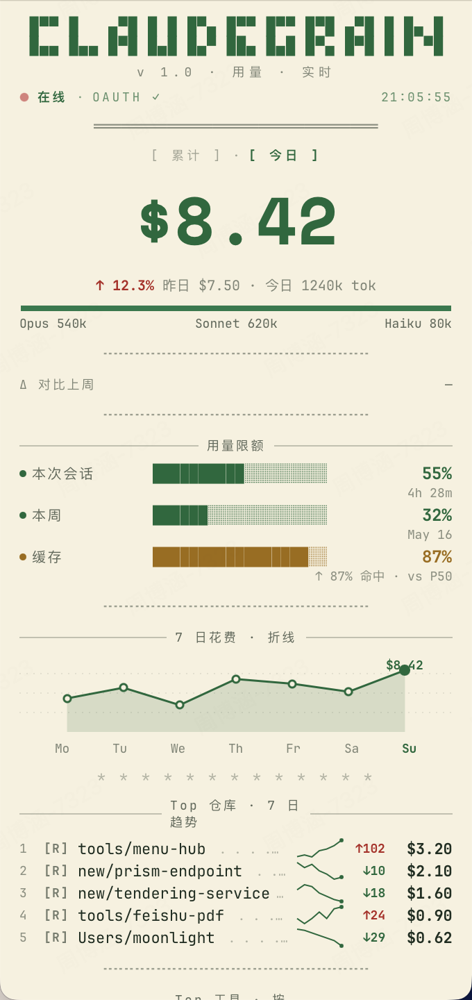

# claudegrain

Granular Claude Code usage in your menu bar. Per-repo, per-tool, per-MCP, cache-hit attribution — none of the existing trackers do this.

| Phosphor (dark) | Thermal paper (light) |
| --- | --- |
|  |  |

## What sets it apart

| Feature | claudegrain | ccseva | ClaudeBar | ClaudeUsageBar | claudecodeusage |
| --- | --- | --- | --- | --- | --- |
| Session block % + reset | ✓ | ✓ | ✓ | ✓ | ✓ |
| Weekly limit | ✓ | partial | ✓ | ✓ | ✓ |
| **Per-repo $ attribution** | ✓ | — | — | — | — |
| **Per-tool token attribution** | ✓ | — | — | — | — |
| **Per-MCP server attribution** | ✓ | — | — | — | — |
| **Cache hit %** | ✓ | — | — | — | — |
| Native Swift / SwiftUI | ✓ | Electron | ✓ | ✓ | ✓ |

## Data sources (3-tier fallback)

1. **OAuth Path** — Reads Claude Code OAuth token from macOS Keychain, calls
   the undocumented `api.anthropic.com/api/oauth/usage` endpoint. Zero
   configuration, real values for session + weekly limits.
2. **JSONL Path** — Parses `~/.claude/projects/**/*.jsonl` directly. Powers all
   the per-repo / per-tool / per-MCP / cache-hit attribution (the OAuth API
   doesn't expose any of this). Also serves as fallback for rate limits via
   P90 estimation.
3. **CLI Path** — Final fallback: shells out to `claude /usage` and scrapes
   stdout. Used only when both above fail.

See [docs/adr/0001-three-tier-data-source.md](docs/adr/0001-three-tier-data-source.md).

## Install

Grab the latest DMG from [GitHub Releases](https://github.com/FlyTOmeLight/claudegrain/releases/latest).

> **First launch — Gatekeeper hoop**
>
> The current builds are **ad-hoc signed** (we haven't paid for an Apple
> Developer ID yet). macOS will refuse to open the app on first launch.
>
> 1. Drag **claudegrain.app** into `/Applications/`
> 2. Right-click the app → **Open** → confirm
> 3. Subsequent launches open normally
>
> Or via Terminal:
> ```sh
> xattr -dr com.apple.quarantine /Applications/claudegrain.app
> open /Applications/claudegrain.app
> ```

Requires macOS 14+ (Sonoma). Apple Silicon and Intel both supported.

### Build from source

```bash
git clone https://github.com/FlyTOmeLight/claudegrain
cd claudegrain
DEVELOPER_DIR=/Applications/Xcode.app/Contents/Developer \
  bash scripts/build-dmg.sh
open dist/claudegrain.app
```

Bundle id is `dev.claudegrain.menubar` (override via `BUNDLE_ID=...`).
See [`scripts/README.md`](scripts/README.md).

## Privacy

- All credentials stay on your machine. No telemetry. No analytics.
- The OAuth token is read from your Keychain, only sent to
  `api.anthropic.com`.
- JSONL parsing is local-only.
- Source is fully open under MIT — verify yourself.

## License

MIT — see [LICENSE](LICENSE).
